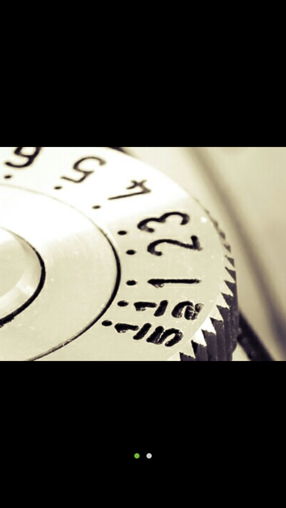

# IOSComponent
Personal little tool

---

## 1.UIButton+Block
**在初始化的时候通过block完成绑定**

```
_orderButton = [UIButton buttonWithType:UIButtonTypeCustom withTargetBlock:^(id sender) {
            weakSelf.orderClick();
            [weakSelf remove];
        }];
```
---

## 2.XMTabberBadge
**因为苹果的badge不支持改颜色，使用Core Graphic 特地写了这个工具**

**set up**

```
self.viewControllers = [NSArray arrayWithObjects:_hotfoodNav,_orderNav,_myNav, nil];
    self.tabBar.badgeColor = [MSColor white];
    self.tabBar.aroundColor = [MSColor red];
    [self.tabBar setUpCustomBadgeView:3];
    
```

---

## 3.MSPictureScorllComponent
a bunch of photo scroll and scale 

<!--https://github.com/LinkRober/MSPictureScorllComponent/blob/master/screenshot.png-->

<div align="left"></div>


